# SensorFusion第六次作业

[TOC]

## ESKF

### 默认参数

效果

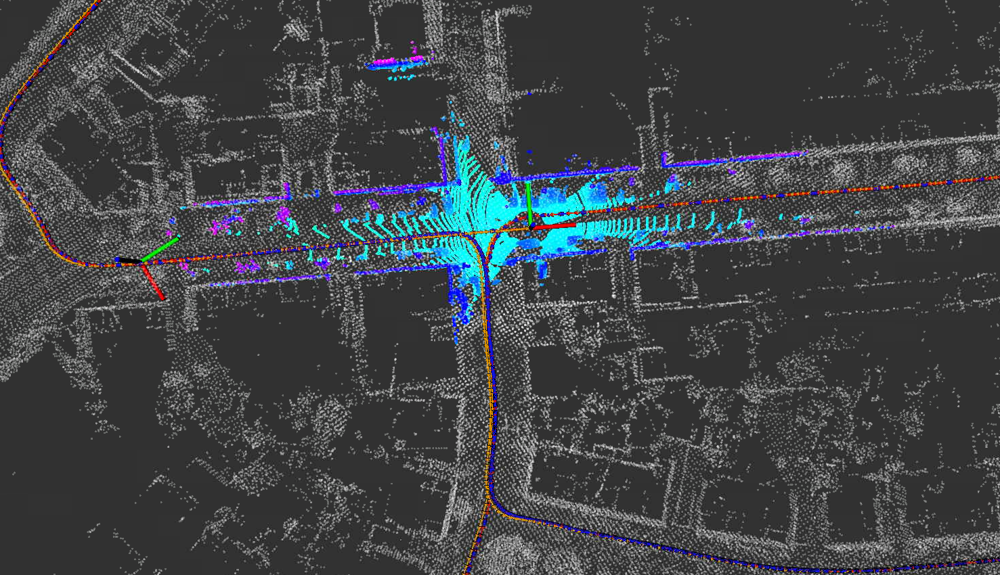

#### 滤波前

       max	1.136680
      mean	0.231254
    median	0.163564
       min	0.017465
      rmse	0.289501
       sse	367.929852
       std	0.174162
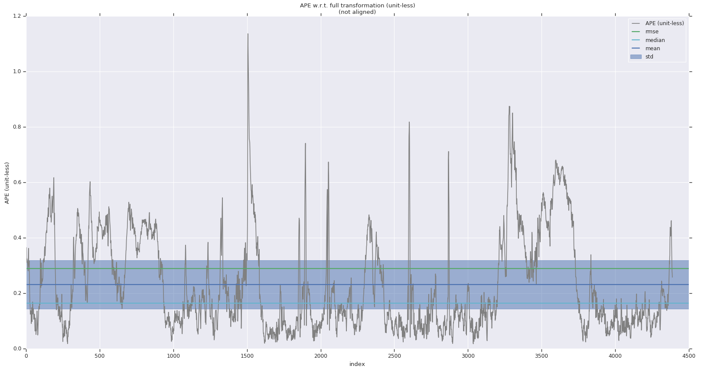

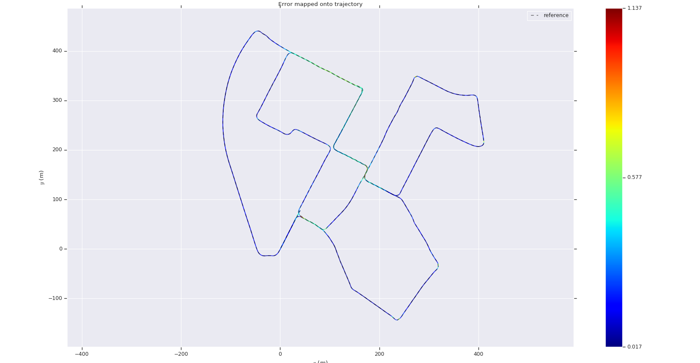

开始处

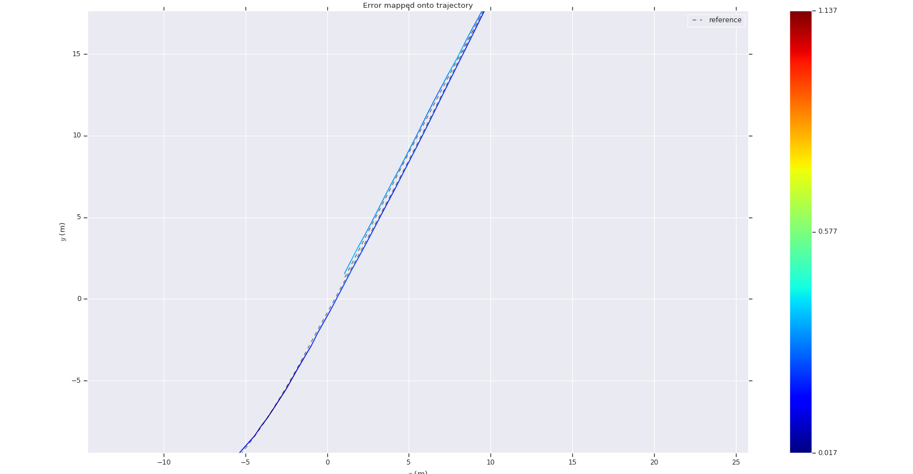

#### 滤波后

       max	1.120305
      mean	0.244671
    median	0.182264
       min	0.012534
      rmse	0.299849
       sse	394.702161
       std	0.173337
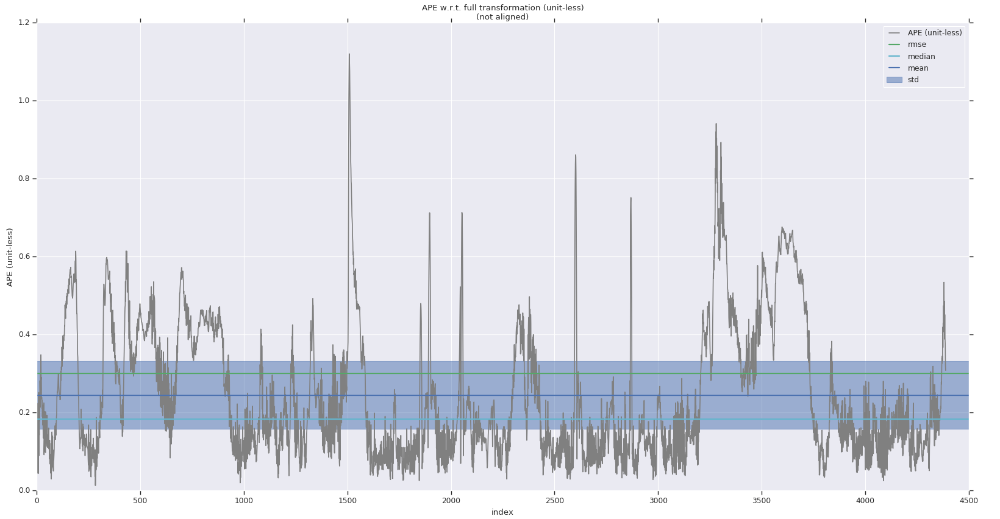

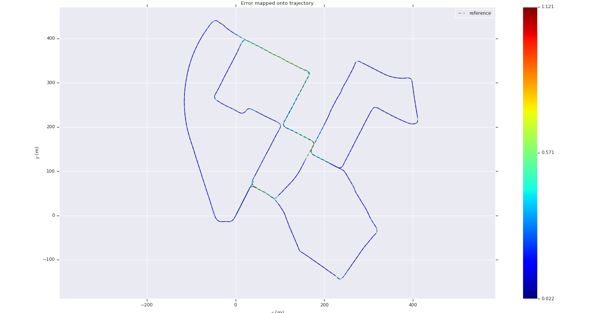

开始处，比激光雷达要好

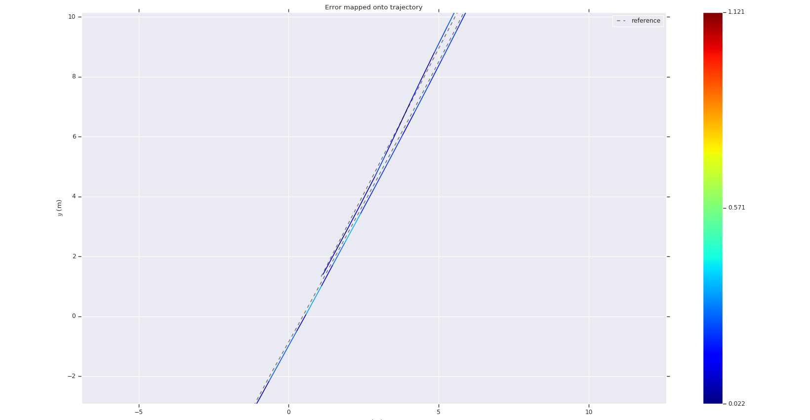

激光雷达轨迹和融合轨迹的误差很小，说明更加相信激光雷达的。

       max	0.394047
      mean	0.070304
    median	0.062288
       min	0.003339
      rmse	0.081256
       sse	28.965441
       std	0.040742


### 参数1

#### 参数

```yaml
    covariance:
        prior:
            pos: 1.0e-5
            vel: 1.0e-5
            ori: 1.0e-5
            epsilon: 1.0e-6
            delta: 1.0e-6
        process:
            gyro_noise: 1.0e-5
            accel_noise: 2.5e-5
            gyro_walk: 1.0e-5
            accel_walk: 2.5e-5
        measurement:
            pose:
                pos: 2.0e-1
                ori: 2.0e-1
            pos: 1.0e-4
            vel: 2.5e-3
```

#### 滤波前

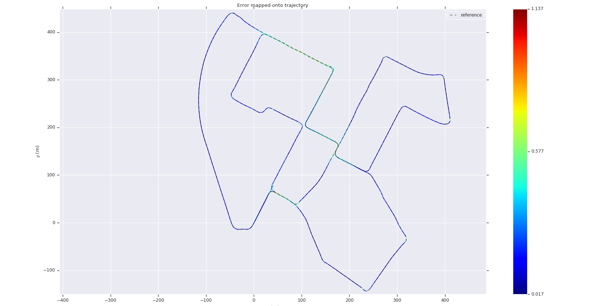

       max	1.136680
      mean	0.231142
    median	0.163627
       min	0.017465
      rmse	0.289274
       sse	366.600726
       std	0.173934
#### 滤波后

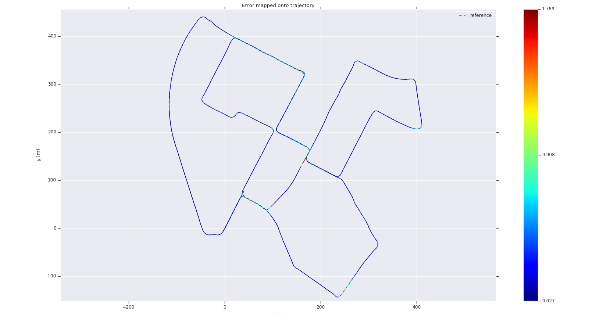

       max	1.789425
      mean	0.316181
    median	0.248966
       min	0.026810
      rmse	0.387849
       sse	659.019287
       std	0.224624
左边是融合前，右边是融合后的

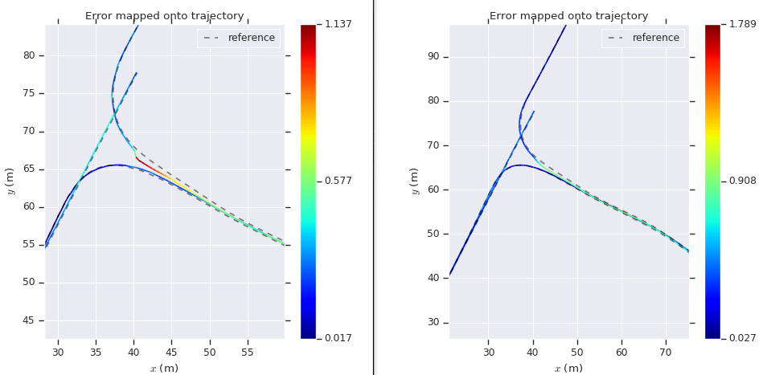

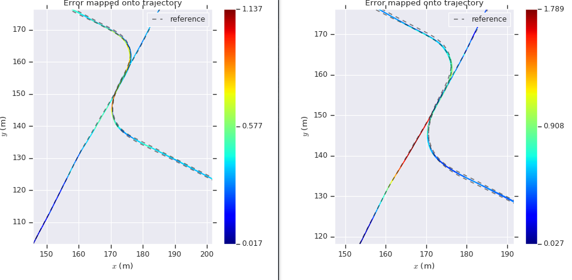

上图融合后的转弯处更加顺滑，下图激光的直线部分误差比较小。

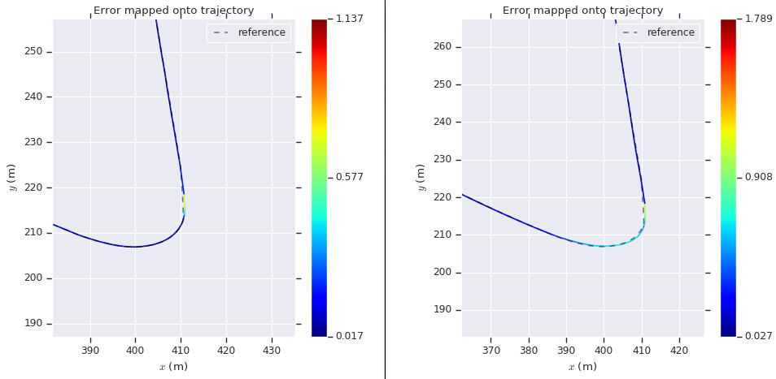

这里融合后的误差更加大。

### 参数2

#### 参数

```yaml
    covariance:
        prior:
            pos: 1.0e-5
            vel: 1.0e-5
            ori: 1.0e-5
            epsilon: 1.0e-6
            delta: 1.0e-6
        process:
            gyro_noise: 1.0e-5
            accel_noise: 2.5e-5
            gyro_walk: 1.0e-5
            accel_walk: 2.5e-5
        measurement:
            pose:
                pos: 2.0e-3
                ori: 2.0e-1
            pos: 1.0e-4
            vel: 2.5e-3
```

#### 滤波前

       max	1.136680
      mean	0.231931
    median	0.164036
       min	0.017465
      rmse	0.290173
       sse	366.691964
       std	0.174380
#### 滤波后

       max	1.131317
      mean	0.278159
    median	0.225524
       min	0.029205
      rmse	0.330322
       sse	475.185780
       std	0.178158
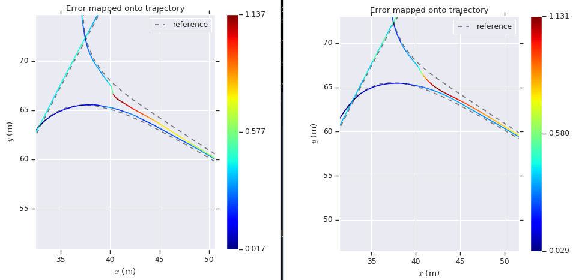

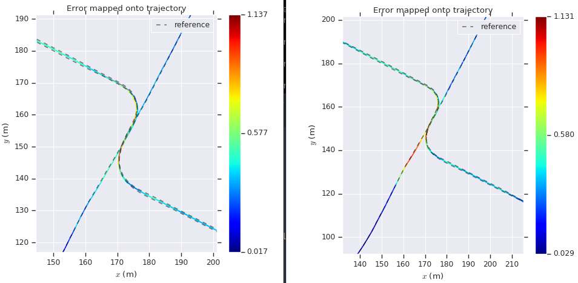


### 参数3

#### 参数

```yaml
    covariance:
        prior:
            pos: 1.0e-5
            vel: 1.0e-5
            ori: 1.0e-5
            epsilon: 1.0e-6
            delta: 1.0e-6
        process:
            gyro_noise: 1.0e-5
            accel_noise: 2.5e-5
            gyro_walk: 1.0e-5
            accel_walk: 2.5e-5
        measurement:
            pose:
                pos: 1.0e-4
                ori: 1.0e-2
            pos: 1.0e-4
            vel: 2.5e-3
```

#### 滤波前

       max	1.136680
      mean	0.231342
    median	0.163955
       min	0.017465
      rmse	0.289456
       sse	365.972245
       std	0.173971
#### 滤波后

       max	1.194392
      mean	0.258817
    median	0.198141
       min	0.029705
      rmse	0.310314
       sse	420.615034
       std	0.171197
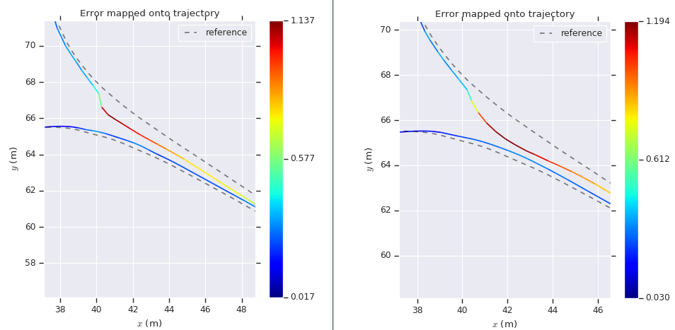

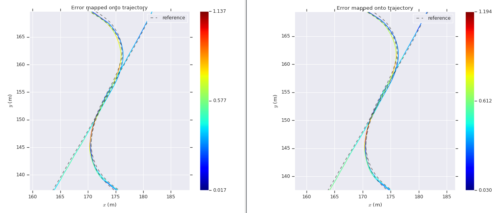

因为激光和IMU定位的噪声数量级接近，这时激光和融合后的效果比较接近。


### 参数4

#### 参数

```yaml
    covariance:
        prior:
            pos: 1.0e-5
            vel: 1.0e-5
            ori: 1.0e-5
            epsilon: 1.0e-6
            delta: 1.0e-6
        process:
            gyro_noise: 1.0e-6
            accel_noise: 1.0e-5
            gyro_walk: 1.0e-5
            accel_walk: 2.5e-4
        measurement:
            pose:
                pos: 1.0e-6
                ori: 1.0e-6
            pos: 1.0e-4
            vel: 2.5e-3
```

#### 滤波后

       max	1.145750
      mean	0.243301
    median	0.182558
       min	0.015522
      rmse	0.297851
       sse	388.483635
       std	0.171814
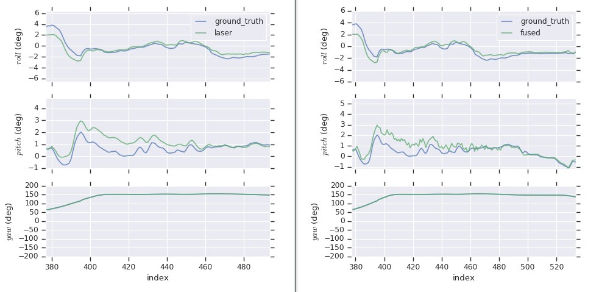

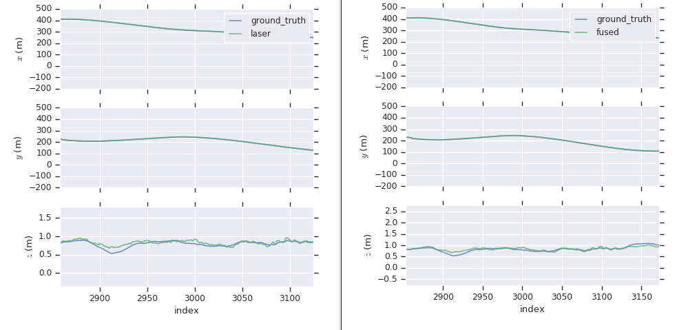

可以发现右图融合IMU之后，角度的噪声变大，说明陀螺仪的噪声被低估了。而z方向的估计融合后更加平滑了，说明噪声估计相对比较准确。

### 参数5

#### 参数

```yaml
    covariance:
        prior:
            pos: 1.0e-6
            vel: 1.0e-6
            ori: 1.0e-6
            epsilon: 1.0e-6
            delta: 1.0e-6
        process:
            gyro_noise: 2.5e-2
            accel_noise: 1.0e-2
            gyro_walk: 1.0e-4
            accel_walk: 1.0e-3
        measurement:
            pose:
                pos: 1.0e-6
                ori: 1.0e-6
            pos: 1.0e-4
            vel: 2.5e-3
```

#### 滤波后

       max	1.164980
      mean	0.234870
    median	0.168759
       min	0.017150
      rmse	0.291701
       sse	373.116764
       std	0.172989


### 分析

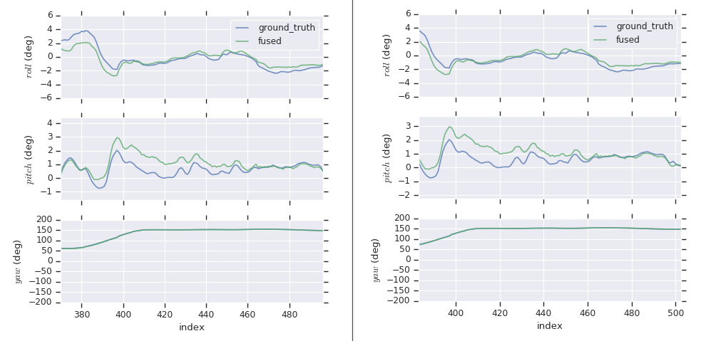

减小了角度的权重后，曲线更加平滑，并且好于默认值。

### 不考虑随机游走

#### 推导

改变的主要是B矩阵，变为
$$
\boldsymbol B_t =
\begin{bmatrix}
0 & 0 & 0 & 0 \\
\boldsymbol R_t &0 & 0 & 0\\
0 & \boldsymbol I_3& 0 & 0 \\
0 & 0 & 0 & 0 \\
0 & 0 & 0 & 0
\end{bmatrix} =
\begin{bmatrix}
0 & 0  \\
\boldsymbol R_t &0  \\
0 & \boldsymbol I_3  \\
\end{bmatrix}
$$
离散化后
$$
\boldsymbol B_t =

\begin{bmatrix}
0 & 0  \\
\boldsymbol R_t T &0  \\
0 & \boldsymbol I_3 T \\
\end{bmatrix}
$$
状态更新也不需要考虑最后6维。

#### 默认参数

       max	1.091670
      mean	0.252422
    median	0.187283
       min	0.019531
      rmse	0.309450
       sse	420.478390
       std	0.179004


#### 分析

与考虑相比效果更差说明普通消费级IMU的零偏噪声很大会随着时间变化，考虑比不考虑更好。


## EKF

==TODO==