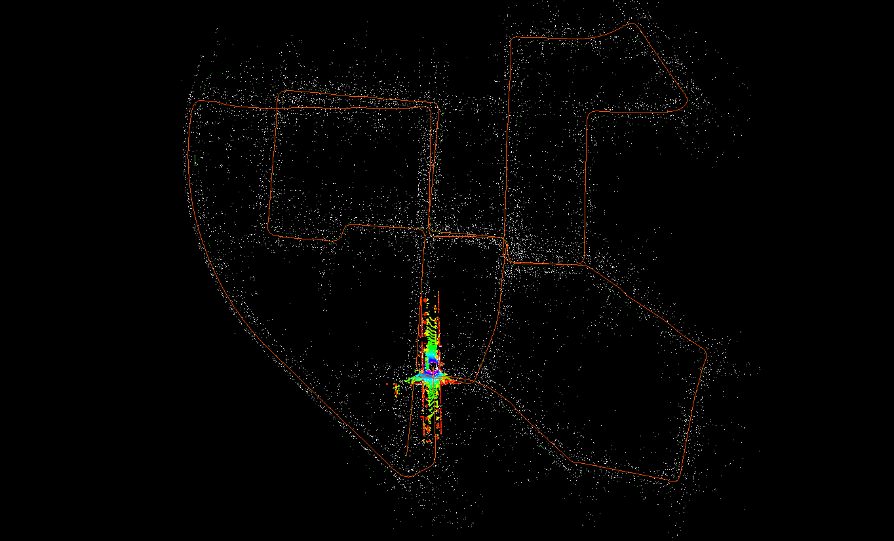
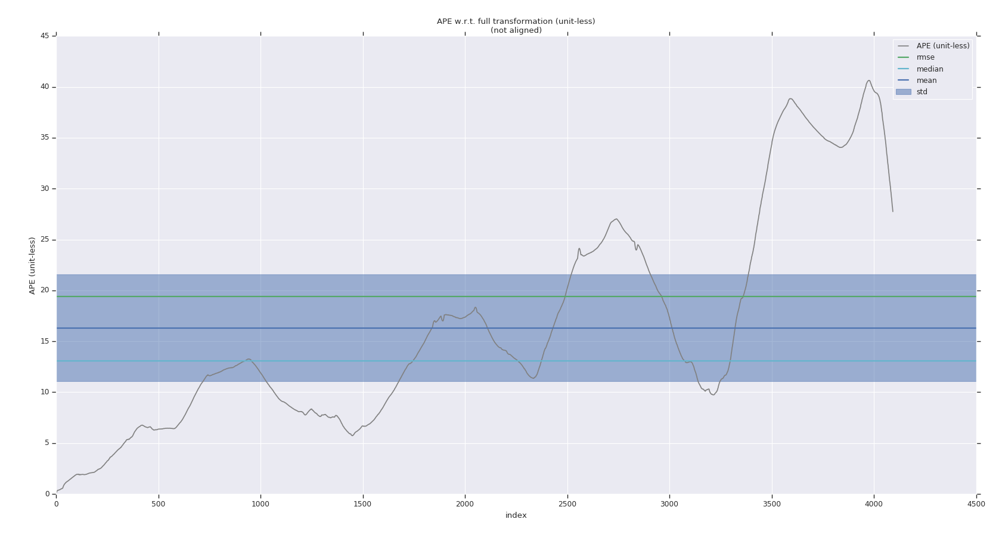
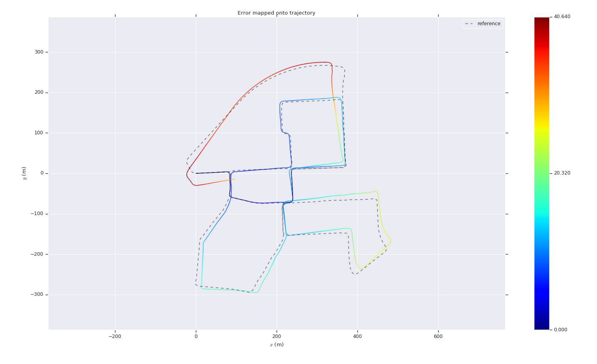
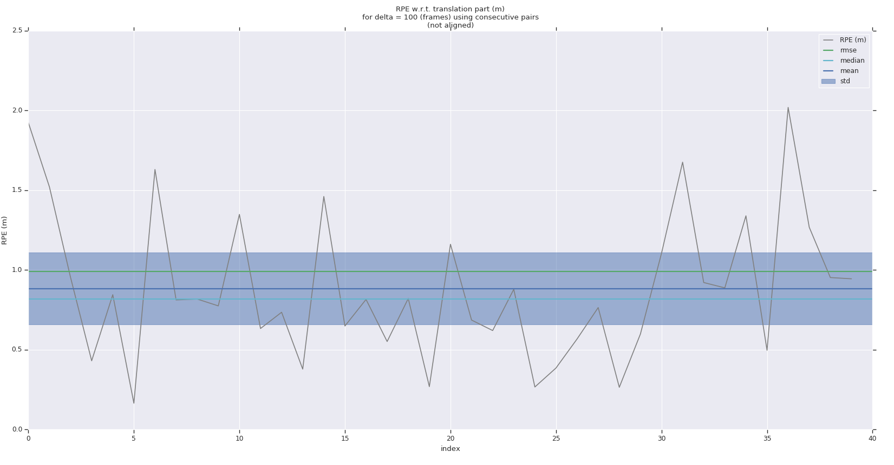
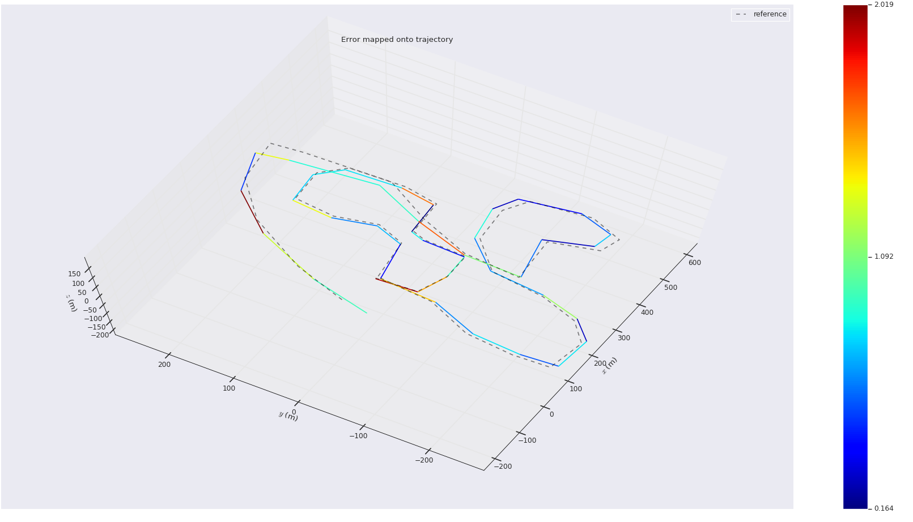

# SensorFusion第二次作业

## 求导结果

### 线特征

残差
$$
d_{\mathcal{E}}=\frac{\left|\left(\tilde{p}_{i}-p_{b}\right) \times\left(\tilde{p}_{i}-p_{a}\right)\right|}{\left|p_{a}-p_{b}\right|}  \tag {1}
$$
其中使用SE3表示$\tilde{p}_{i} = \mathbf Rp_i+\mathbf t=\mathbf Tp_i$

根据链式法则求Jacobian
$$
\frac{\part d_{\mathcal E}}{\part\boldsymbol T}=\frac{\part d_{\mathcal E}}{\part\tilde{p}_{i}}\frac{\part \tilde{p}_{i}}{\part\boldsymbol T} \tag{2}
$$
其中
$$
\begin{aligned}
\frac{\part \tilde{p}_{i}}{\part\boldsymbol T} =\frac{\part \boldsymbol T{p}_{i}}{\part\delta\boldsymbol\xi}  &= \lim _{\delta \xi \rightarrow 0} \frac{\exp \left(\delta \boldsymbol{\xi}^{\wedge}\right) \exp \left(\boldsymbol{\xi}^{\wedge}\right) {p}_i-\exp \left(\boldsymbol{\xi}^{\wedge}\right) {p}_i}{\delta \boldsymbol{\xi}}
\\&
\approx \lim _{\delta \xi \rightarrow 0} \frac{\left(\boldsymbol{I}+\delta \boldsymbol{\xi}^{\wedge}\right) \exp \left(\boldsymbol{\xi}^{\wedge}\right) {p}_i-\exp \left(\boldsymbol{\xi}^{\wedge}\right) {p}_i}{\delta \boldsymbol{\xi}} \\
&=\lim _{\delta \boldsymbol{\xi} \rightarrow 0} \frac{\delta \boldsymbol{\xi}^{\wedge} \exp \left(\boldsymbol{\xi}^{\wedge}\right) {p}_i}{\delta \boldsymbol{\xi}} \\
&=\left[\begin{array}{cc}
\boldsymbol{I} & -(\boldsymbol{R} {p}_i+\boldsymbol{t})^{\wedge} \\
\boldsymbol{0}^{T} & \boldsymbol{0}^{T}
\end{array}\right]
\end{aligned} \tag{3}
$$

$$
\begin{aligned}
\frac{\part d_{\mathcal E}}{\part\tilde{p}_{i}}&=\frac{1}{\left|p_{a}-p_{b}\right|}\frac{\part\left|\left(\tilde{p}_{i}-p_{b}\right) \times\left(\tilde{p}_{i}-p_{a}\right)\right|}{\part\left(\tilde{p}_{i}-p_{b}\right) \times\left(\tilde{p}_{i}-p_{a}\right)}\frac{\part\left(\tilde{p}_{i}-p_{b}\right) \times\left(\tilde{p}_{i}-p_{a}\right)}{\part\tilde p_i} \\
&=\frac{1}{\left|p_{a}-p_{b}\right|}\frac{\left(\tilde{p}_{i}-p_{b}\right) \times\left(\tilde{p}_{i}-p_{a}\right)}{\left|\left(\tilde{p}_{i}-p_{b}\right) \times\left(\tilde{p}_{i}-p_{a}\right)\right|}\left(-\left(\tilde p_i-p_b\right)^\wedge+\left(\tilde p_i-p_b\right)^\wedge\right) \\

&=\frac{1}{\left|p_{a}-p_{b}\right|}\frac{\left(\tilde{p}_{i}-p_{b}\right) \times\left(\tilde{p}_{i}-p_{a}\right)}{\left|\left(\tilde{p}_{i}-p_{b}\right) \times\left(\tilde{p}_{i}-p_{a}\right)\right|}\left(p_a-p_b\right)^\wedge

\end{aligned} \tag{4}
$$

### 面特征

残差
$$
d_{\mathcal{H}}=\left(\tilde{p}_{i}-p_{j}\right) \bullet \frac{\left(p_{l}-p_{j}\right) \times\left(p_{m}-p_{j}\right)}{\left|\left(p_{l}-p_{j}\right) \times\left(p_{m}-p_{j}\right)\right|} \tag{5}
$$
其中使用SE3表示$\tilde{p}_{i} = \mathbf Rp_i+\mathbf t=\mathbf Tp_i$

根据链式法则求Jacobian
$$
\frac{\part d_{\mathcal H}}{\part\boldsymbol T}=\frac{\part d_{\mathcal H}}{\part\tilde{p}_{i}}\frac{\part \tilde{p}_{i}}{\part\boldsymbol T} \tag{6}
$$
其中后一项和线特征的相同
$$
\begin{aligned}
\frac{\part \tilde{p}_{i}}{\part\boldsymbol T} =
&=\left[\begin{array}{cc}
\boldsymbol{I} & -(\boldsymbol{R} {p}_i+\boldsymbol{t})^{\wedge} \\
\boldsymbol{0}^{T} & \boldsymbol{0}^{T}
\end{array}\right]
\end{aligned} \tag{7}
$$

$$
\begin{aligned}
\frac{\part d_{\mathcal H}}{\part\tilde{p}_{i}}&=\frac{\left(p_{l}-p_{j}\right) \times\left(p_{m}-p_{j}\right)}{\left|\left(p_{l}-p_{j}\right) \times\left(p_{m}-p_{j}\right)\right|} \frac{\part\left(\tilde p_i-p_j\right)}{\part \tilde p_j}
\\ &=\frac{\left(p_{l}-p_{j}\right) \times\left(p_{m}-p_{j}\right)}{\left|\left(p_{l}-p_{j}\right) \times\left(p_{m}-p_{j}\right)\right|}
\end{aligned} \tag{8}
$$

## 原来的Aloam效果

### APE

       max	40.640195
      mean	16.320709
    median	13.059950
       min	0.000000
      rmse	19.397878
       sse	1540480.783223
       std	10.483898

### RPE

       max	2.019105
      mean	0.882913
    median	0.816025
       min	0.163916
      rmse	0.991167
       sse	39.296487
       std	0.450419

## 改成解析形式之后

###  APE

       max	44.561692
      mean	17.526954
    median	15.198962
       min	0.000001
      rmse	20.484578
       sse	1738477.190663
       std	10.603010

### RPE

       max	5.015183
      mean	1.081213
    median	0.978228
       min	0.221067
      rmse	1.343110
       sse	73.961688
       std	0.796820

