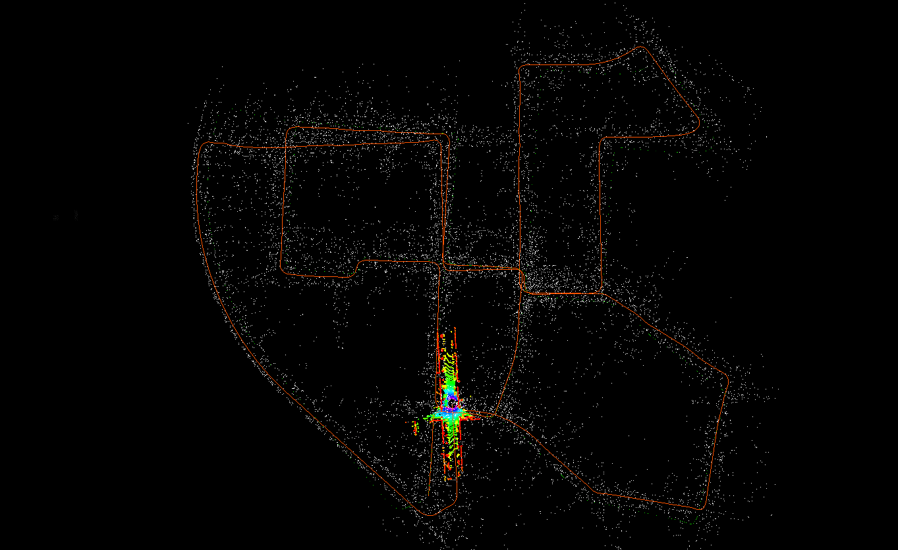
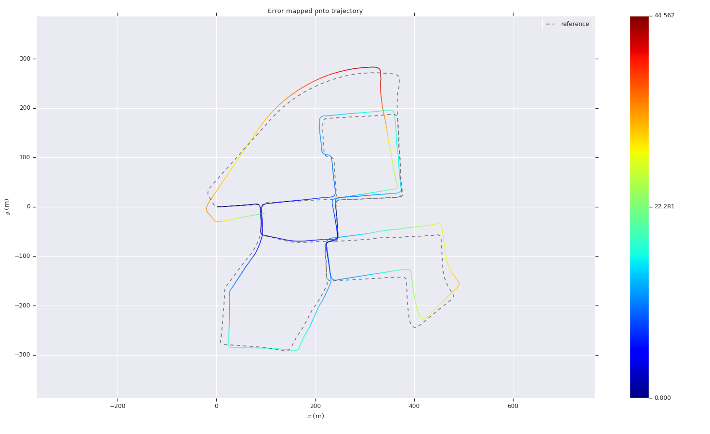
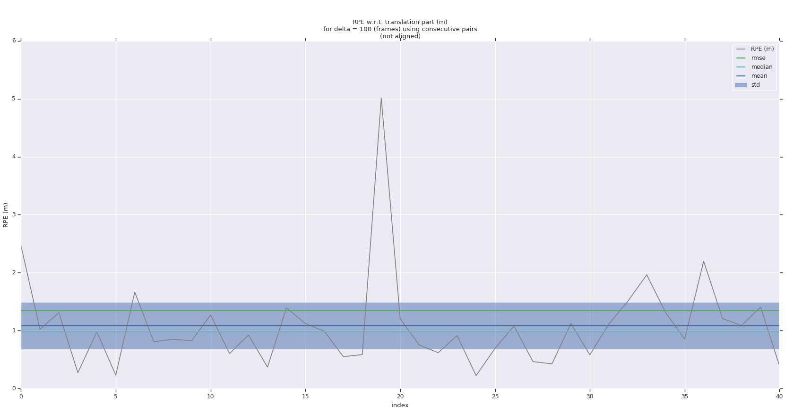
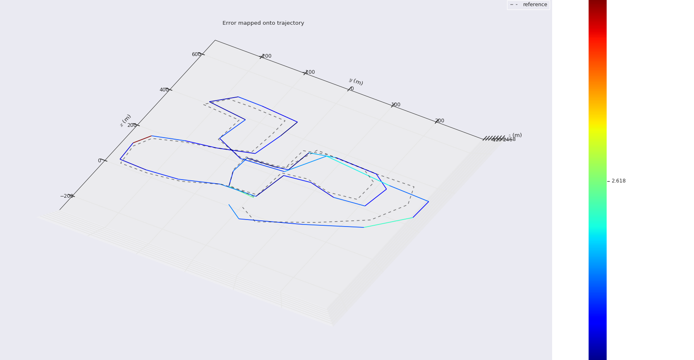

# SensorFusion第二次作业

## 原来的Aloam效果

## 改成解析形式之后

###  APE

       max	44.561692
      mean	17.526954
    median	15.198962
       min	0.000001
      rmse	20.484578
       sse	1738477.190663
       std	10.603010

### RPE

       max	5.015183
      mean	1.081213
    median	0.978228
       min	0.221067
      rmse	1.343110
       sse	73.961688
       std	0.796820

