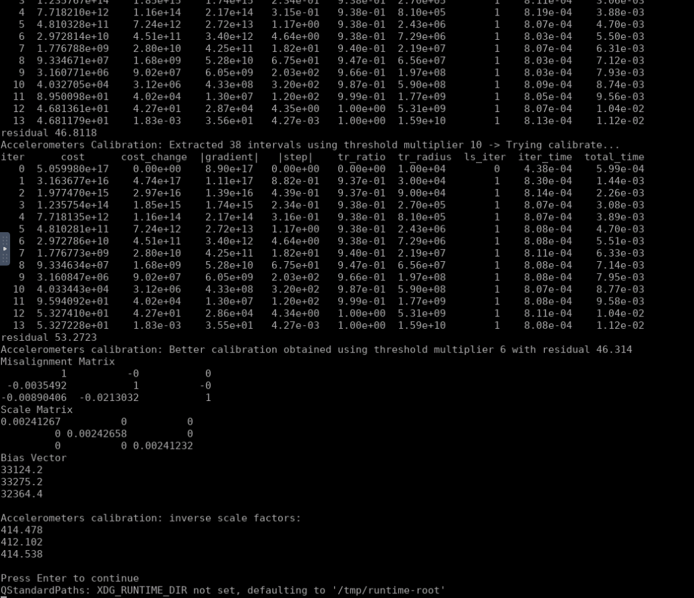

# SensorFusion第四节作业

## Jacobian推导

参考代码中的建模，有：
$$
\boldsymbol X_{u}=\mathbf T \cdot \mathbf K\cdot (\boldsymbol X-\mathbf B) \tag{1}
$$
其中$\boldsymbol X_u$表示矫正之后的加速度数据，$\boldsymbol X$表示读取的原始数据，且
$$
\mathbf T=
\begin{bmatrix}
1   & 0 & 0 \\
t_1 & 1 & 0 \\
-t_2 & t_3 & 1\\
\end{bmatrix} \quad 
\mathbf K = 
\begin{bmatrix}
s_1 & & \\
&s_2& \\
&&s_3
\end{bmatrix}
\quad \mathbf B=
\begin{bmatrix}
b_1\\
b_2\\
b_3
\end{bmatrix}
$$
展开有
$$
\begin{aligned}
x_u&= s_1(x-b_1) \\
y_u&= s_1t_1(x-b_1)+s_2(y-b_2)  \\
z_u&= -s_1t_2(x-b_1)+s_2t_3(y-b_2)   +s_3(z-b_3)
\end{aligned} \tag{2}
$$
残差函数有
$$
{r} = \|\boldsymbol g\|^2-\|\boldsymbol  X_u\|^2 \tag{3}
$$

应用链式法则求导
$$
\begin{aligned}
\frac{\part r}{\part t}&=\frac{\part r}{\|\boldsymbol  X_u\|^2} \left(\frac{\|\boldsymbol  X_u\|^2}{\part  x_u} \frac{\part x_u}{\part t}+ \frac{\|\boldsymbol  X_u\|^2}{\part y_u} \frac{\part y_u}{\part t}+\frac{\|\boldsymbol  X_u\|^2}{\part  z_u} \frac{\part z_u}{\part t} \right) \\
\frac{\part r}{\part s}&=\frac{\part r}{\|\boldsymbol  X_u\|^2} \left(\frac{\|\boldsymbol  X_u\|^2}{\part  x_u} \frac{\part x_u}{\part s}+ \frac{\|\boldsymbol  X_u\|^2}{\part y_u} \frac{\part y_u}{\part s}+\frac{\|\boldsymbol  X_u\|^2}{\part  z_u} \frac{\part z_u}{\part s} \right) \\
\frac{\part r}{\part b}&=\frac{\part r}{\|\boldsymbol  X_u\|^2} \left(\frac{\|\boldsymbol  X_u\|^2}{\part  x_u} \frac{\part x_u}{\part b}+ \frac{\|\boldsymbol  X_u\|^2}{\part y_u} \frac{\part y_u}{\part b}+\frac{\|\boldsymbol  X_u\|^2}{\part  z_u} \frac{\part z_u}{\part b} \right) \\
\end{aligned} \tag{4}
$$
进一步有
$$
\begin{aligned}
\frac{\part r}{\part t_1} &= -\left( 2y_us_1(x-b_1)\right)   \\
\frac{\part r}{\part t_2} &= -\left( -2z_us_1(x-b_1)\right)  \\
\frac{\part r}{\part t_3} &= -\left( 2z_us_2(y-b_2)\right)  \\
\end{aligned} \tag{5}
$$

$$
\begin{aligned}
\frac{\part r}{\part s_1} &= -\left( 2x_u(x-b_1)+2y_ut_1(x-b_1)-2z_ut_2(x-b_1)\right)  \\
\frac{\part r}{\part s_2} &= -\left( 2y_u(y-b_2) +2z_ut_3(y-b_2)\right)  \\
\frac{\part r}{\part s_3} &= -\left( 2z_u(z-b_3)\right)  \\
\end{aligned} \tag{6}
$$

$$
\begin{aligned}
\frac{\part r}{\part b_1} &= -\left( 2x_u(-s_1)+2y_u(-s_1t_1)-2z_u(-s_1t_2)\right)  \\
\frac{\part r}{\part b_2} &= -\left( 2y_u(-s_2)+2z_u(-s_2t_3)\right)  \\
\frac{\part r}{\part b_3} &= -\left( 2z_u(-s_3)\right)  \\
\end{aligned} \tag{7}
$$

## 原来的解


## 解析求导解

代码更改：

~~~C++
// 解析形式，下三角
template <typename _T1>
class MultiPosAccFactor : public ceres::SizedCostFunction<1, 9>
{
public:
    MultiPosAccFactor( 
    const _T1 &g_mag, 
    const Eigen::Matrix< _T1, 3 , 1> &sample 
  ) : g_mag_(g_mag), sample_(sample){}
  ~MultiPosAccFactor() {}

  virtual bool Evaluate( double const * const *parameters, double* residuals, double **jacobians) const
  {
    Eigen::Matrix<double, 3, 1> X(double(sample_(0)), 
                                  double(sample_(1)),
                                  double(sample_(2)));
    CalibratedTriad_<double> calib_triad(
      // mis_yz, mis_zy, mis_zx:
      0.0, 0.0, 0.0,
      // mis_xz, mis_xy, mis_yx:
      parameters[0][0], parameters[0][1], parameters[0][2],
      //    s_x,    s_y,    s_z:
      parameters[0][3], parameters[0][4], parameters[0][5], 
      //    b_x,    b_y,    b_z: 
      parameters[0][6], parameters[0][7], parameters[0][8] 
    );

    Eigen::Matrix<double, 3, 1> Xu = calib_triad.unbiasNormalize( X );
    residuals[0] = double (g_mag_)*double (g_mag_) - Xu.norm()*Xu.norm();

    if(jacobians != NULL)
    {
      double t1 = calib_triad.misXZ();
      double t2 = calib_triad.misXY();
      double t3 = calib_triad.misYX();

      double s1 = calib_triad.scaleX();
      double s2 = calib_triad.scaleY();
      double s3 = calib_triad.scaleZ();

      double b1 = calib_triad.biasX();
      double b2 = calib_triad.biasY();
      double b3 = calib_triad.biasZ();

      double xu = Xu(0);  double x = X(0);
      double yu = Xu(1);  double y = X(1);
      double zu = Xu(2);  double z = X(2);
      
      if(jacobians[0] != NULL)
      {
        // dr/dt
        jacobians[0][0] = -2*yu*s1*(x-b1);
        jacobians[0][1] = 2*zu*s1*(x-b1);
        jacobians[0][2] = -2*zu*s2*(y-b2);
        // dr/ds
        jacobians[0][3] = -2*xu*(x-b1)-2*yu*t1*(x-b1)+2*zu*t2*(x-b1);
        jacobians[0][4] = -2*yu*(y-b2)+2*zu*t3*(y-b2);
        jacobians[0][5] = -2*zu*(z-b3);
        // dr/db
        jacobians[0][6] = 2*xu*s1+2*yu*s1*t1-2*zu*s1*t2;
        jacobians[0][7] = 2*yu*s2+2*zu*s2*t3;
        jacobians[0][8] = 2*zu*s3;
      }
    }
    return true;
  }

  static inline ceres::CostFunction* create(const _T1 &g_mag, const Eigen::Matrix< _T1, 3 , 1> &sample )
  {
    return (new MultiPosAccFactor(g_mag, sample));
  }

private:
  const _T1 g_mag_;
  const Eigen::Matrix< _T1, 3 , 1> sample_;
};
~~~

```C++
// 其它就是更改了安装误差的顺序，上三角变下三角
```





可见结果和原来的接近。