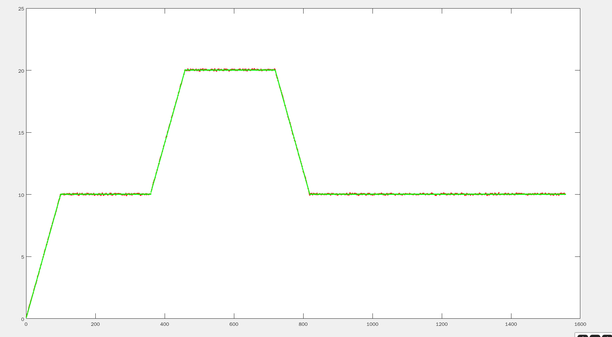

# SensorFusion第七次作业

[TOC]

## KITTI（默认参数）

### 增加运动模型约束前

       max	1.093954
      mean	0.251182
    median	0.195883
       min	0.020161
      rmse	0.301639
       sse	399.883827
       std	0.167014
### 增加运动模型约束后

       max	1.043278
      mean	0.245699
    median	0.186092
       min	0.022955
      rmse	0.298224
       sse	389.813656
       std	0.169026
### 部分路段对比

左边为增加速度约束之前，右边是增加了运动模型约束，可以发现图中部分误差较小。

### 速度曲线对比

其中红色的是增加运动模型约束的，绿色为没有运动模型约束的

#### V_x

#### V_y

#### V_z

#### 总结

综上可以看出，增加了运动约束（红色）的速度误差是好于没有增加的（绿色）

---

## GNSS_INS_SIM

### no_error

#### 位置约束

##### 轨迹误差

       max	2.222331
      mean	0.206233
    median	0.189190
       min	0.016501
      rmse	0.252193
       sse	99.027420
       std	0.145152

其中GNSS误差为

       max	2.842398
      mean	2.096743
    median	2.148564
       min	0.036520
      rmse	2.280333
       sse	8096.273791
       std	0.896431
##### 速度误差

红色的为估计值，绿色为真值

vx

vy

vz

#### 位置约束+速度约束

##### 轨迹误差

       max	0.889535
      mean	0.187412
    median	0.183697
       min	0.023407
      rmse	0.218405
       sse	74.365630
       std	0.112150

##### 速度误差

绿色的为真值，红色的为计算出的（发现gnss_ins_sim生成的速度真值是world系下的，代码里面注释错误，这里都转为载体下）

vx

vy

vz

#### 总结

可以发现增加了速度约束，对精度略有提升，对速度的误差改善较大。

### high_accuracy

           max	0.869552
          mean	0.201305
        median	0.185546
           min	0.017288
          rmse	0.228060
           sse	81.085946
           std	0.107182
GNSS的误差

       max	2.868513
      mean	2.115988
    median	2.154794
       min	0.031402
      rmse	2.287161
       sse	8155.290293
       std	0.868158

### mid_accuracy

       max	1.128796
      mean	0.393956
    median	0.374236
       min	0.040851
      rmse	0.427608
       sse	284.695324
       std	0.166275
GNSS误差

       max	3.408872
      mean	2.322735
    median	2.373987
       min	0.156634
      rmse	2.437074
       sse	9247.532567
       std	0.737720

误差变得更大了。

　调了调参数，降低了GPS的权重，效果好一点：

       max	1.028537
      mean	0.310223
    median	0.284578
       min	0.027437
      rmse	0.347850
       sse	188.638051
       std	0.157356