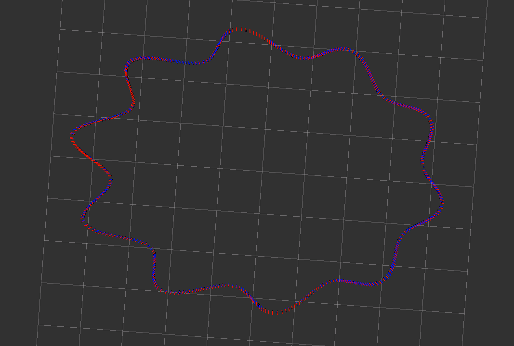

# SensorFusion第五次作业

[TOC]

误差评估直接使用gt和est得到的值做差，平均值得到。

## Euler

## Mid-Value

加长版本

## RK4

加长版本

综合来看四阶龙格库塔方法对比中值法并没有明显优势，需要进一步分析对比。

## 使用gnss_ins_sim来生成仿真数据

## 静止

### Euler

### Mid

### RK4

## 加速运动

### Euler

### Mid

### RK4

RK4主要差别在旋转处，这个没有旋转所以mid和rk4精度相同。

## 减速运动

### Euler

### Mid

### RK4

## 匀速运动

### Euler

### Mid

### RK4

## 快速转弯

### Euler

### Mid

### RK4

## 剧烈运动

### Euler

### Mid

### RK4

## 结论

1. 在静止下，几种算法没有区别
2. 在加速，减速，匀速运动时，欧拉法会好于中值法，需要进一步分析 ==TODO==
3. 在有转弯的情况下，剧烈运动情况下，中值法会好很多，而且龙格库塔对剧烈的旋转效果更好一些（RK4也和实现方法有关）

