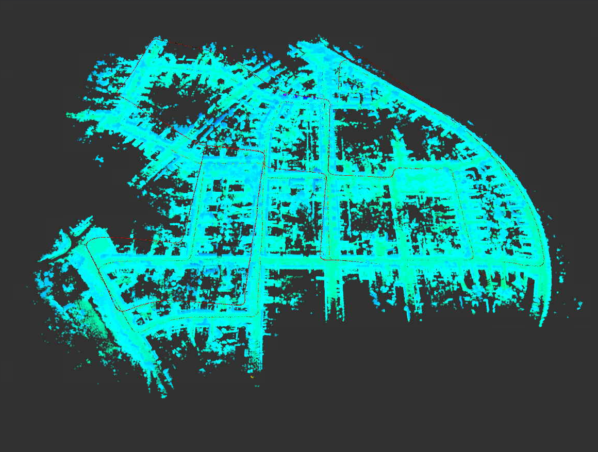
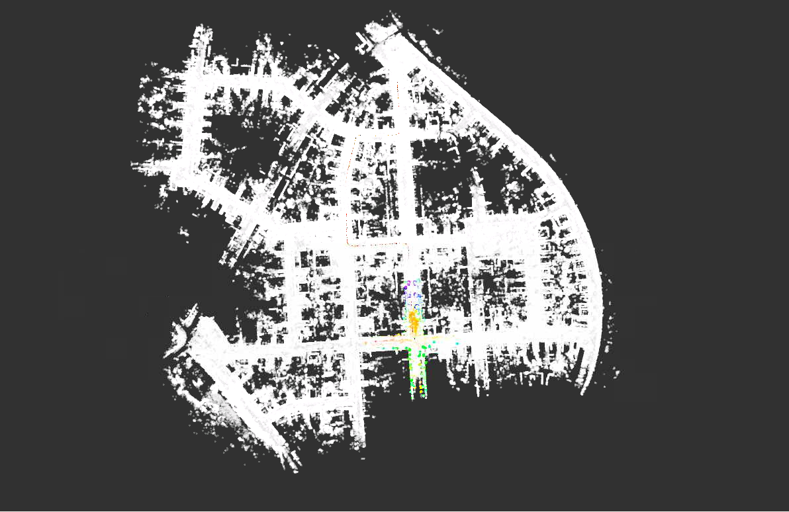
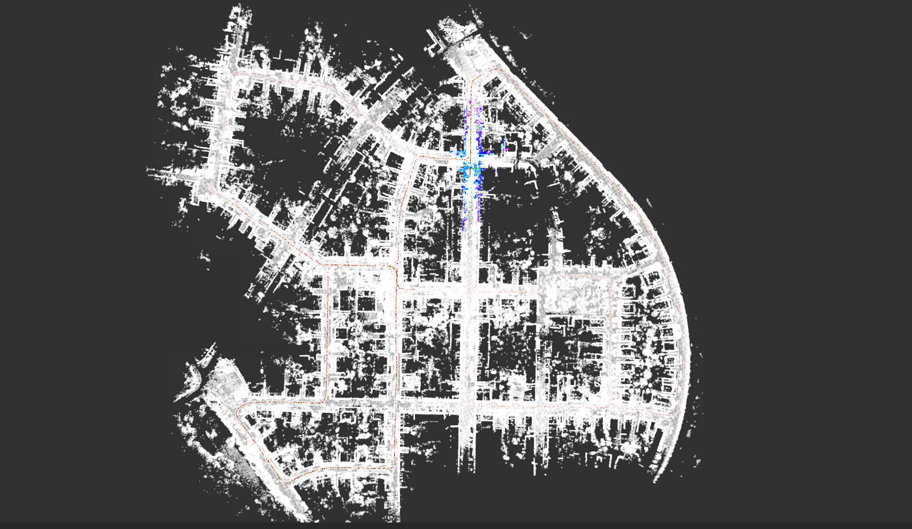
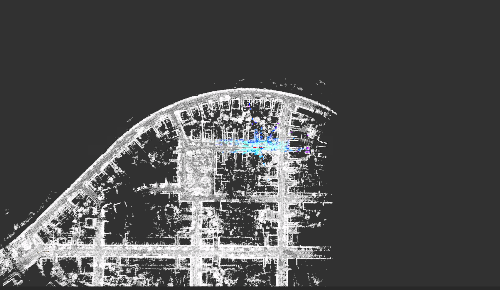
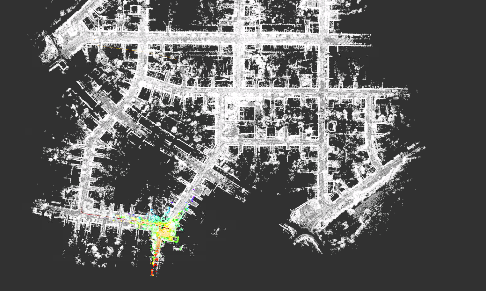
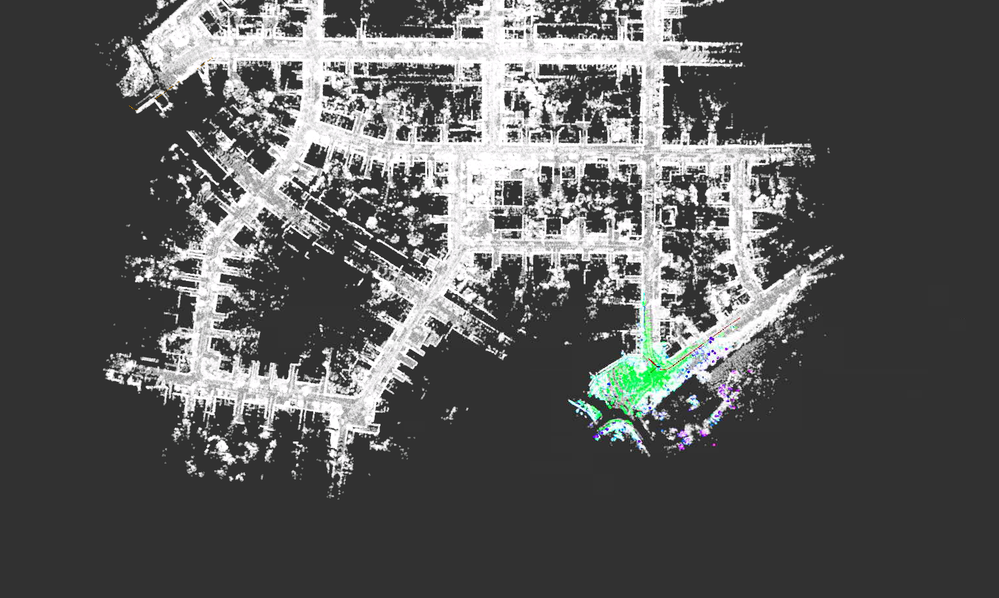
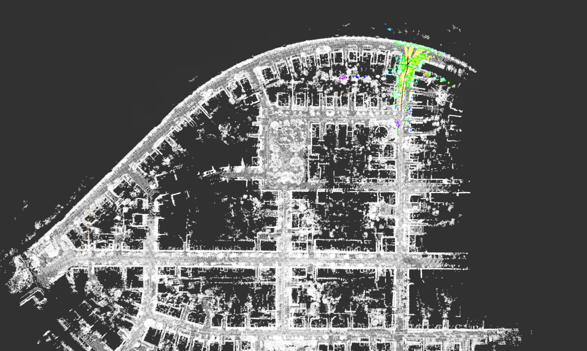

# SensorFusion第三次作业

## 保存地图

原点处的初始化地图定位不成功。

## 地图匹配

### GNSS Init

零点处使用GNSS

最终轨迹

### Scan Context效果

这个代码的GPS原点默认在第一帧，因此使用GNSS作为初始位姿好像不能使用，没办法提供粗略的初始位姿，只能使用闭环匹配的办法。

#### 100处

### 200处

### 300处

### 400处

